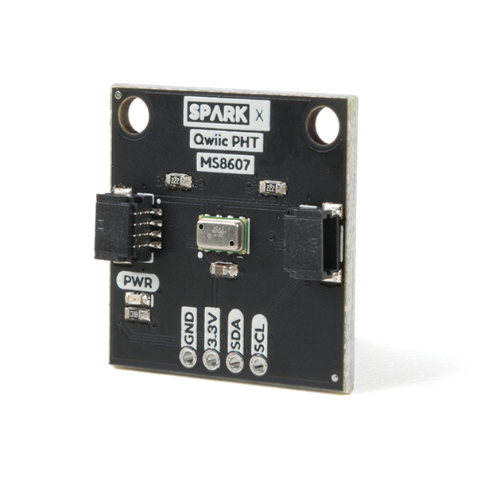

# Qwiic PHT Sensor MS8607

The TE MS8607 combined pressure, humidity and temperature sensor in Qwiic format.

[Qwiic PHT Sensor MS8607 (SPX-16298)](https://www.sparkfun.com/products/16298)

The MS8607 sensor is a self-contained pressure, humidity and temperature sensor that is fully calibrated during manufacture.
The sensor can operate from 1.5V to 3.6V. The MS8607 is ideal for weather station applications embedded into compact devices and
any applications in which pressure, humidity and temperature monitoring is required. The pressure sensor will operate down to
10mbar which is equivalent to an altitude of approx. 31,000m making it suitable for high altitude ballooning and other low pressure
applications.

## Specifications

- Operating pressure range: 10 to 2000 mbar
- Measures relative humidity from 0% to 100%
- Measures temperature from -40C to 85C
- Fast response time
- I2C communication
- Very low power consumption

## Repository Contents
- **/Hardware** - Eagle schematic and PCB design files
- **/Documents** - contains the TE datasheet
- **LICENSE.md** contains the licence information

## Library

- **[Arduino Library](https://github.com/sparkfun/SparkFun_PHT_MS8607_Arduino_Library)** - Library for reading pressure in mBar, altitude, etc.
